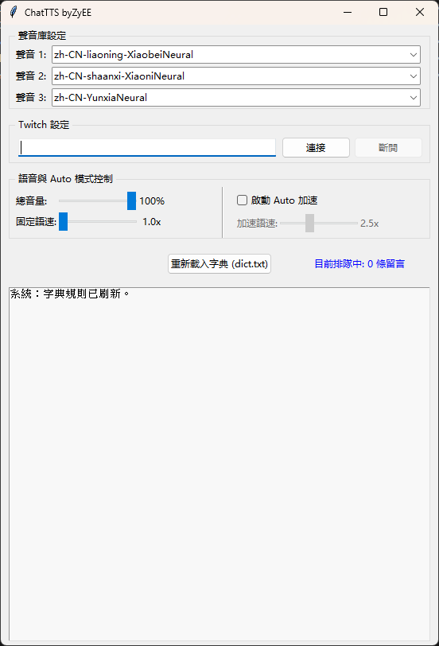

# ChatTTS
一個基於 Edge-TTS 的 Twitch 聊天室語音助手。
## 開發說明 (Credits)
- **主要開發者**：[ZyEE](https://github.com)
- **技術支持**：本專案由 ZyEE 構思與指導，並由 Google Gemini (AI) 輔助編寫代碼實現。
- **版權聲明**：歡迎轉載或二次開發，但請務必保留原作者標註與 AI 協作說明。

## 字典過濾功能 (`dict.txt`)
程式會讀取同目錄下的 `dict.txt` 進行自定義替換或忽略。

### 格式說明：
`舊詞,新詞`（中間用半角逗號隔開）

- **連結替換標籤**：
  - `[TWITCH_LINK],圖奇連結`
  - `[YOUTUBE_LINK],油兔連結`
  - `[OTHER_LINK],發了個連結`
- **忽略特定詞彙**（逗號後留空）：
  - `討厭的詞,`
- **一般詞彙替換**：
  - `777,溜溜溜`
